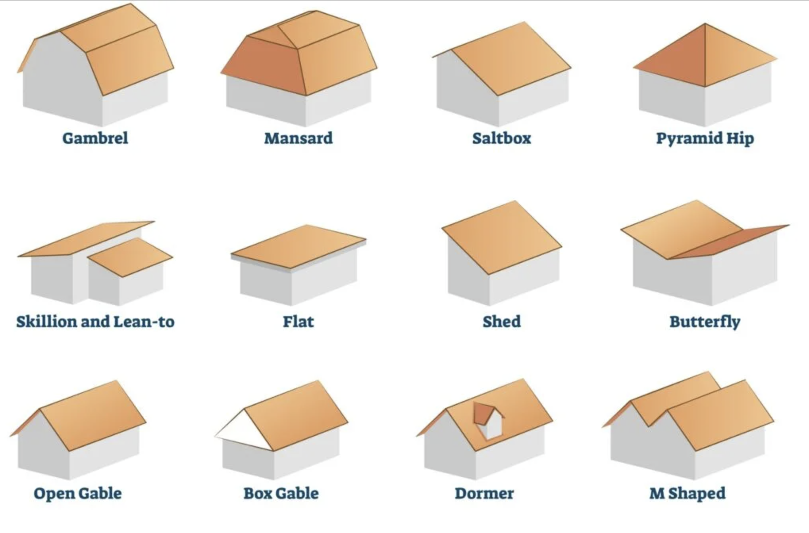
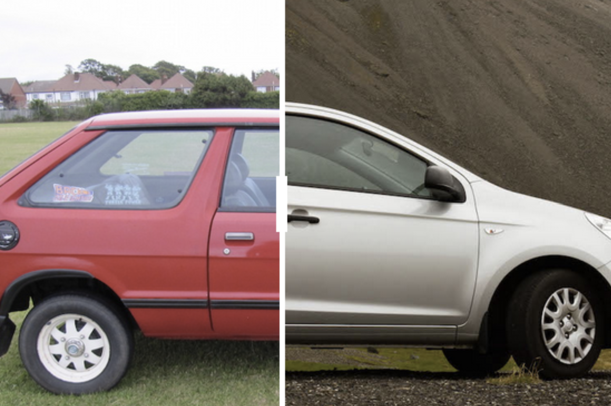

## Roof Designs and Sleek Automobiles

Christopher Alexander was an architect and design theorist who was influential in the field of pattern language, a term coined by him in his 1977 book *A Pattern Language*. Pattern language invovles the use of a set of organized and coherent design patterns that describes a problem and the core of the solution that may be used in a specific domain. Alexander is quoted, saying:

>"Each pattern describes a problem which occurs over and over again in our environment, and then describes the core of the solution to that problem, in such a way that you can use this solution a million times over, without ever doing it the same way twice."

His influence has extended into urban design, sociology, and software.

  

We encounter design patterns everyday in our life, most notably with roofs and automobiles. With regards to roofs, there are many different designs, each having strengths and weaknesses depending on the location of a house. For example, the butterfly roof would not work well for places with a lot of snow or rain, such as Alaska and Hawaii, respectively.

  

For autombiles, we have moved toward a more sleek design across many different car bodies. Today, we see much less of that boxy design that was prevalent in the '70s to early '80s. Through design patterns, we have found that the current curvy look of automobiles allows for efficient aerodynamics since the curved exteriors of the car allows for less wind resistance and thus less gas needing to be burned to move the car.

## Model-view-controller in Software

  

There are various design patterns in software, with a prevalent one being the model-view-controller (MVC). When implementing a user interface, the MVC entails separating the model (state of the system) from the way it is presented to the user; it can be thought of as your database. The view is the presentation to the user, so in the context of a web application, it would be the HTML and CSS files. The third component, the controller, decides what view is presented to the user and how the state of the model changes.

In my software engineering class, we have been making use of the MVC for our project, a web application called [Manoa Menu](https://github.com/manoa-menu/manoa-menu). Using MVC to develop a web application is great because the design patterns align with the different skills that each member of a group has. This allows for people with different skill sets in databases or user interfaces to parition responsibilities effectively, all while allowing for concurrent development on the application. Throughout development on Manoa Menu so far, we have been effectively making use of the MVC to manage our data with PostgreSQL for our user and language translation data, TypeScript (.tsx) with React and CSS for handling our layout and display of pages, and routing files to route commands to the model and view parts. Overall, design patterns have helped to create coherent and thoughtful solutions to problems that can be applicable in many domains.
