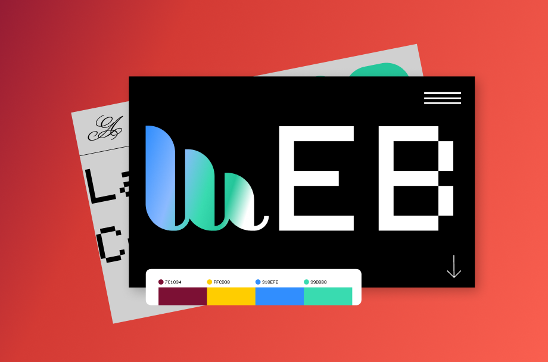
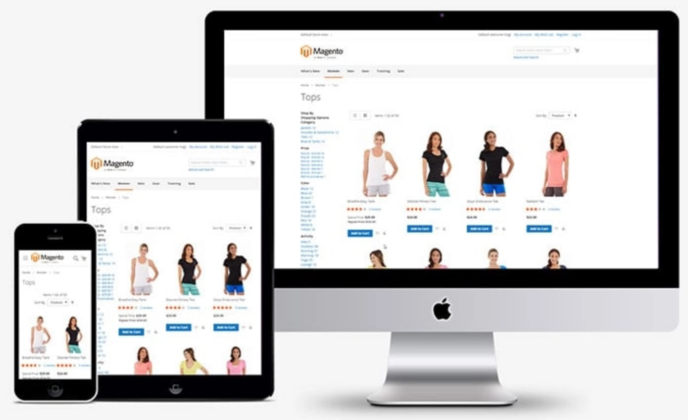

  

## An Alternative to Raw CSS

Web design can be a tedious process. This is exemplified by the monotonous nature of creating attractive websites with raw CSS and HTML, which involves a lot of style blocks. To cut down on this process and streamline website development, you can use UI/CSS frameworks. These frameworks provide a set of CSS classes and/or JavaScript functions that simplify layout development, create an attractive look and feel, and help ensure consistency across browsers. There are many frameworks available; I am currently utilizing Bootstrap for my ICS 314 (Software Engineering) class.

## Bootstrap

  
  

Bootstrap is one of many UI/CSS frameworks for responsive web design (RWD) and mobile-first front-end development. As a leader in mobile-first design, it aims to render pages that are well-suited for mobile devices. No special coding is required to format the UI for a mobile-sized screen. RWD encompasses the overarching idea of rendering web pages on a variety of devices. Web pages can be viewed on laptops, tablets, and phones, all of which vary in screen size and aspect ratio. The responsiveness of RWD ensures usability and satisfactory viewing of web pages, regardless of the device you use. Another great aspect of Bootstrap is the provision of tools, such as a set of icons in a [free library](https://icons.getbootstrap.com/).

## Creating Websites

In ICS 314, we gained experience utilizing Bootstrap by practicing the recreation of website designs. We decided to simplify the website components compared to the original to familiarize ourselves with Bootstrap. Although I needed to refer to documentation frequently, the practice was a fun endeavor that made web design less tedious. One example of a website we recreated is [Murphy's Bar & Grill](https://www.murphyshawaii.com/). My recreation can be seen below:

  

Bootstrap is a great tool for creating responsive and attractive websites without the need to slog through raw HTML and CSS. In general, I recommend CSS frameworks to web developers, whether that be [Bootstrap](https://getbootstrap.com/), [Tailwind CSS](https://tailwindcss.com/), or something more minimalist like [Pico CSS](https://picocss.com/).
