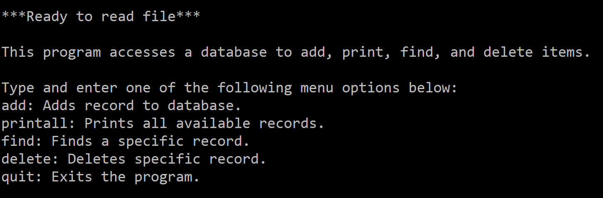

This database user interface was created as a project for the ICS 212 class at UH Manoa. This project was the culmination of a few homeworks that we began at the beginning of the semester with the ultimate goal being to create a database with a simple user interface.

The database is implemented using the C programming language within the Unix system. The database supports the addition of a record, printing all avaialble records, finding a specific record, deleting a sepcific record, and quitting the program. This project was indepently done with the student required to fully implement and test their own database program.

In this project I gained experience with utilizing multiple software to organize files and write the program including Vi, FileZilla, and PuTTY. As such, I got a lot of practice with Unix commands to navigate the file system and organize my files and being able to compile my source code and link my object files to run the program. I had previously only utilized integrated development environments (IDEs) to write programs so utilizing Vi helped me appreciate the simplicity of a text editor without the fully configured features of an IDE like a powerful debugger.

Here is some example code to illustrate how the program adds a record to the database:

```
int addRecord(struct record **start, int accountno, char name[], char address[])
{
    struct record* current;
    struct record* previous;
    struct record* new_record;
    int return_val;

    if (debug_mode == 1)
    {
        printf("\n********** DEBUG MODE **********\n");
        printf("Debug: addRecord called.\n");
        printf("Debug: accountno = %d\n", accountno);
        printf("Debug: name = %s\n", name);
        printf("Debug: address = %s\n", address);
        printf("********************************\n\n");
    }

    return_val = 0;
    current = *start;
    previous = NULL;

    while (current != NULL && current->accountno < accountno)
    {
        previous = current;
        current = current->next;
    }
    if (current != NULL && current->accountno == accountno)
    {
        return_val = -1;
    }
    else
    {
        new_record = (struct record*)malloc(sizeof(struct record));
        new_record->accountno = accountno;
        strncpy(new_record->name, name, 25);
        strncpy(new_record->address, address, 45);

        if (previous == NULL)
        {
            new_record->next = *start;
            *start = new_record;
        }
        else
        {
            new_record->next = previous->next;
            previous->next = new_record;
        }
    }
    return return_val;
}
```
 
You can check out the entire source code here: [Project 1](https://github.com/usradam/ICS-212/tree/main/project1)
