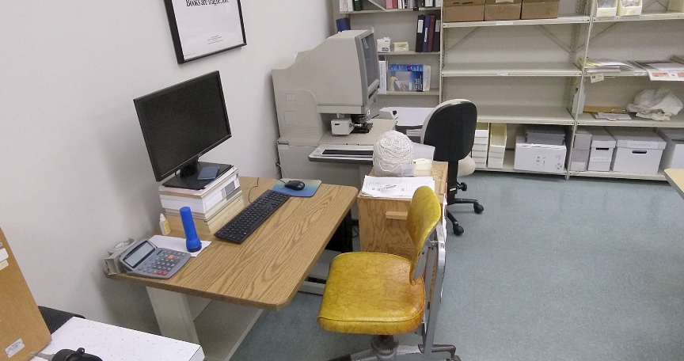
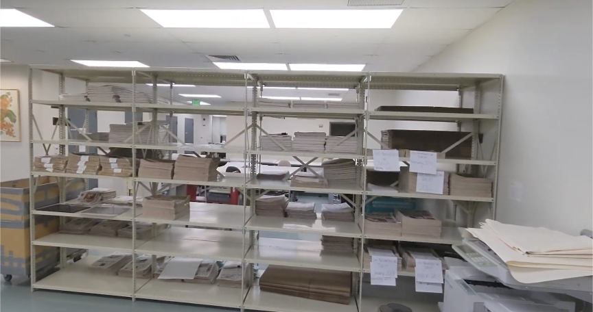
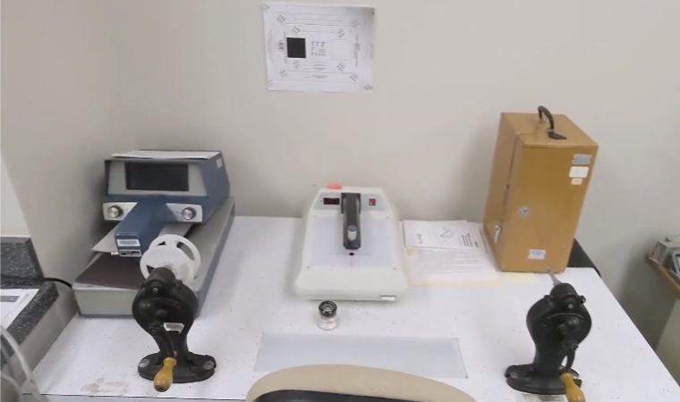

  

    

    

    

    

  

  

    <!-- add any images you want here using inputs -->
    <!-- these inputs also support a link tag and an alt tag -->
    <input type="hidden" imgurl="../img/microfilm/microfilm-reader.png" subtitle="Estamos de aniversario">
    <input type="hidden" imgurl="../img/microfilm/newspaper-shelf.png" subtitle="Something about airborne">
    <input type="hidden" imgurl="../img/microfilm/reel-quality-check.png" subtitle="This is the third subtitle">
  

  

  

    

    

    

      
      
      
      
    

  

  
  
  

At my workplace, my colleagues and I undertake multiple projects in a fiscal year which consist of Hawaiian and Pacific newspaper titles that must be collated, tracked, and shipped to our microfilm vendor. Afterwards, we perform a quality control inspection on the microfilm reels using microscopes, magnifiers, and a microfilm reader.

For these projects, it requires a big undertaking to make sure we meet contract deadlines. It is essential to have team collaboration and each person must perform their duties in a timely manner. My colleagues and I are each responsible for a few things: prepping the newspapers (ironing the creases), collating the total frame count, noting irregularities e.g. ink bleeds and pagination errors, creating and maintaining computer-generated targets with all the info we have recorded to be later printed out, and packing the newspaper and targets together with miscellaneous paperwork.

The job has improved my skill of double-checking and noticing certain irregularities missed (even if miniscule) since my colleagues and I need to cross-reference each other's work to ensure we did not miss anything when collating the newspaper the first time. These projects have also given me the opportunity to train and supervise new employees; I walk them through the microfilming process, teach them how to use microfilm tools, and answer any questions they may have. Although this process may seem mundane, it has provided me with great interpersonal workplace skills and the chance to meet and know some friendly people.
