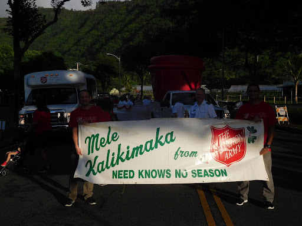
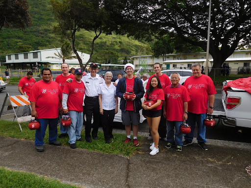
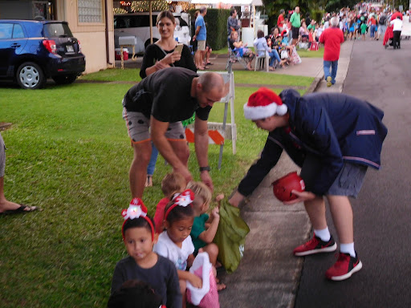

  
  
  

The National Honor Society (NHS) allows members to be actively involved in their community as it emphasizes community service and this service culminates in the form of a service project. My service project was in coordination with the Salvation Army for the yearly Manoa Community Christmas Parade. The project consisted of members and volunteers marching in the parade under the Salvation Army name to spread joy and candy to the community. Other members from NHS were able to join my service project but unfortunately only one could commit.

For this project, I participated as a volunteer with the Salvation Army alongside the many other participants. I had reached out to the Salvation Army with the premise of being able to contribute to the parade through my service project. I maintained close communication with event coordinators and my fellow NHS member to ensure we arrived to the parade on time and to verify the head count of total participants. The parade route was from Noelani Elementary to Manoa Valley District Park and lasted from 4:00 pm - 6:00 pm.

The experience was familiar as I had participated in the Manoa Community Christmas Parade when my brother did it through his Boy Scouts troop. However, this time it was a self-independent experience as I was the sole person to organize and advertise a role in the parade. The parade was a success but recruting more people to join me is something I needed to improve upon.
